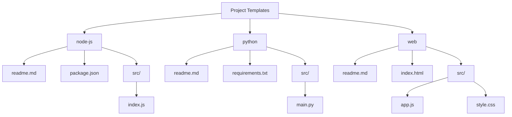

# Template Initialization Guide

This template includes automated setup scripts to initialize new projects with all necessary files and configuration.

## Quick Start

### **Windows (PowerShell)**
```powershell
.\init-template.ps1 C:\path\to\new-project
.\init-template.ps1 C:\path\to\new-project -Git
```

### **macOS / Linux (Bash)**
```bash
./init-template.sh ~/path/to/new-project
./init-template.sh ~/path/to/new-project --git
```

### **Cross-Platform (Node.js)**
```bash
node init-template.js <target-folder>
node init-template.js <target-folder> --git
```

## What Gets Copied

The initialization script copies all template files to your new project:
- ✅ `.github/` — GitHub configuration (Copilot instructions)
- ✅ `.vscode/` — VS Code settings and styles
- ✅ `.gitignore` — Git ignore patterns
- ✅ `.vscodeignore` — VS Code extension ignore patterns
- ✅ `agents.md` — Workspace agent instructions
- ✅ `claude.md` — Claude-specific workflow documentation
- ✅ `*.code-workspace` — Workspace configuration (auto-renamed to project name)

## Options

### Initialize with Git (`--git` flag)
Automatically initializes a git repository and creates an initial commit:

```powershell
.\init-template.ps1 C:\my-project -Git
```

```bash
./init-template.sh ~/my-project --git
```

```bash
node init-template.js ../my-project --git
```

## Examples

### Example 1: Basic Setup (Windows)
```powershell
cd C:\projects
.\init-template.ps1 .\new-app
cd new-app
code new-app.code-workspace
```

### Example 2: Setup with Git Initialization (macOS)
```bash
cd ~/projects
./init-template.sh ./new-app --git
cd new-app
code new-app.code-workspace
```

### Example 3: Node.js Direct (Any Platform)
```bash
cd /path/to/template
node init-template.js /path/to/projects/new-app --git
```

## File Renaming

The template includes `template.code-workspace`. After initialization, this file is automatically renamed to match your project name:
- Input: `template.code-workspace`
- Output: `<project-name>.code-workspace`

For example, if you run:
```
init-template.ps1 C:\projects\my-analyzer
```

The workspace file becomes: `my-analyzer.code-workspace`

## Troubleshooting

### PowerShell Execution Policy
If you get an "cannot be loaded because running scripts is disabled" error:
```powershell
Set-ExecutionPolicy -ExecutionPolicy RemoteSigned -Scope CurrentUser
```

### Git Not Found
Ensure git is installed and in your PATH. The `--git` flag requires git to be available.

### Node.js Not Found
Ensure Node.js is installed. Check with:
```
node --version
npm --version
```

## Manual Setup Alternative

If scripts don't work, manually copy all template files to your new project folder, then initialize git:
```bash
git init
git add .
git commit -m "chore: initialize project from template"
```

---

# Project Template Generator VS Code Extension

This extension allows you to quickly scaffold new projects from predefined templates (Node.js, Python, Web) using a context menu command. It features a template type selector and only copies the files needed for the selected project type.

## Project Templates Overview



## Features
- Right-click in the Explorer to create a new project from a template
- Choose from multiple template types
- Only essential files are copied
- All VSIX builds are output to the `package/` folder

## Usage
1. Open the command palette or right-click in the Explorer and select **Create Project from Template**.
2. Choose your desired template type.
3. The template files will be copied into the selected folder.

## Development
- Run `npm install` to install dependencies
- Run `npm run package` to build and package the extension (VSIX will be in `package/`)

## Adding Templates
Add new templates and their files under the `templates/` directory. Update `src/extension.ts` to include the new template type and its files.
